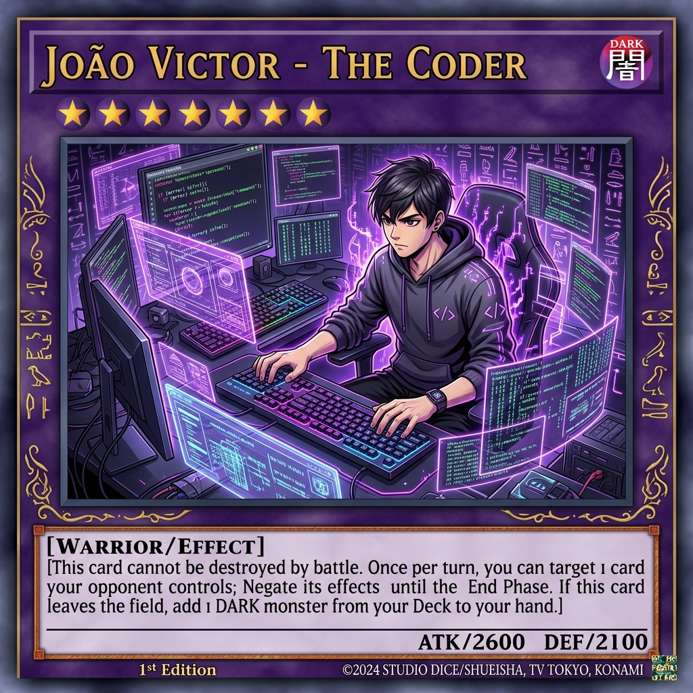

<div align="center">


<br>

<a href="https://github.com/JoaoVRSM">
  
</a>

<br><br>

<a href="https://github.com/JoaoVRSM?tab=followers">
  
</a>
&nbsp;
<a href="https://github.com/JoaoVRSM">
  
</a>

</div>

<br>

---

<br>

<div align="center">
  <h2>🏆 CARTA DO DUELISTA</h2>
  <br>
  
  <br><br>
  <sub><i>ATK/2600 &nbsp; DEF/2100 &nbsp; | &nbsp; Atributo: DARK &nbsp; | &nbsp; Tipo: Warrior/Effect</i></sub>
</div>

<br>

---

<br>

<h2 align="center">🃏 Ficha do Duelista</h2>

<br>

```js
const duelista = {
    nome: "Joao Victor",
    titulo: "O Programador das Sombras",
    reino: "Brasil",
    academia: "PUC Minas - ADS",
    deckPrincipal: ["Node.js", "Python", "JavaScript"],
    cartaFavorita: "Mago Negro",
    lifePoints: 8000,
    vitorias: "++crescendo"
};
```

<br>

- 🎓 Estudante de **ADS** na **PUC Minas**
- 💰 Criador de **bots de pagamento automatizado**
- 🧙‍♂️ Meu deck: **JavaScript** + **Python** + **Node.js**
- 🌑 Codifico no **Reino das Sombras** (de madrugada)
- ☕ Carta armadilha ativada: **Café Infinito!**

<br>

---

<br>

<h2 align="center">⚔️ Deck de Tecnologias</h2>

<br>

<div align="center">

<h4>🟣 Monstros de Efeito — Linguagens</h4>

<a href="#"></a>
<a href="#"></a>
<a href="#"></a>
<a href="#"></a>

<br><br>

<h4>🟢 Cartas Mágicas — Backend & Ferramentas</h4>

<a href="#"></a>
<a href="#"></a>
<a href="#"></a>
<a href="#"></a>

<br><br>

<h4>🔴 Cartas Armadilha — APIs & Integrações</h4>

<a href="#"></a>
<a href="#"></a>

</div>

<br>

---

<br>

<h2 align="center">📊 Status do Duelo</h2>

<br>

<div align="center">
  <a href="https://github.com/JoaoVRSM">
    
  </a>
  &nbsp;
  <a href="https://github.com/JoaoVRSM">
    
  </a>
</div>

<br>

<div align="center">
  <a href="https://github.com/JoaoVRSM">
    
  </a>
</div>

<br>

<div align="center">
  <a href="https://github.com/JoaoVRSM">
    
  </a>
</div>

<br>


<div align="center">

<h3>✨ <i>"Acredite no coração das cartas!"</i> — Yugi Muto</h3>

<br>

```
╔═══════════════════════════════════════════════╗
║                                               ║
║        🃏  DUELO FINALIZADO!                  ║
║                                               ║
║    Obrigado por visitar meu perfil.           ║
║    Que o Coração das Cartas                   ║
║    esteja com você!  ✨                       ║
║                                               ║
║    LP: ████████████████████ 8000 / 8000       ║
║                                               ║
╚═══════════════════════════════════════════════╝
```

<br>


</div>

